# RestaurantFinder
3 Apps Project. Users can search for your nearby restaurants using client app. Admin app adds restaurants. Owners have app for managing their restaurants. Made using Firebase and Google Maps.

Some Previews Of The Application:

## The User App

### The App Startup

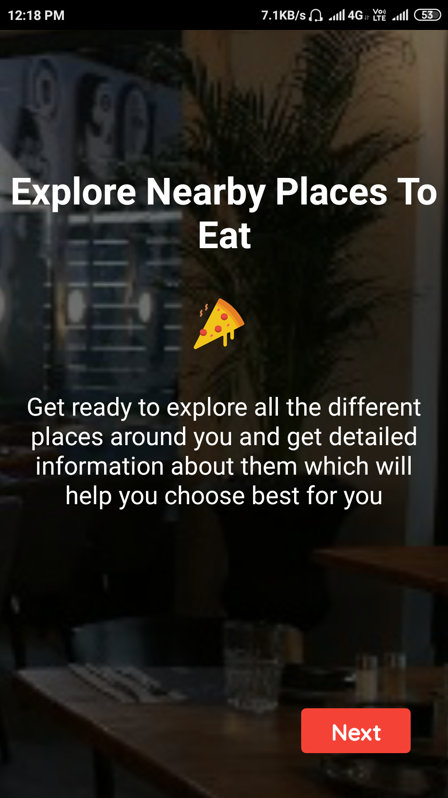
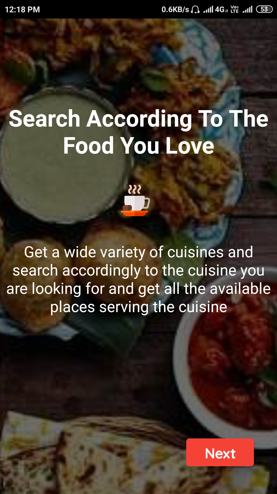

### The Login Screen

### Loading Shimmer

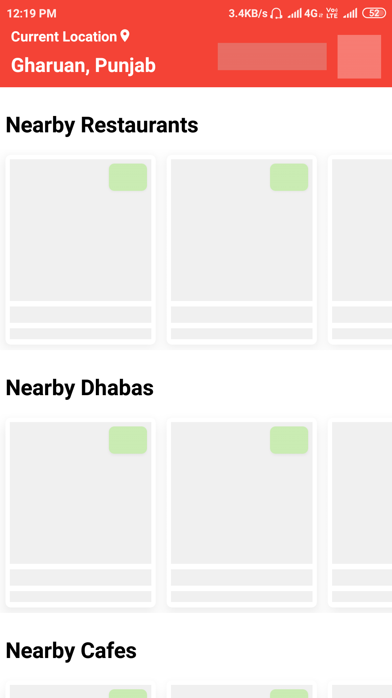

### Choose places you are looking for?

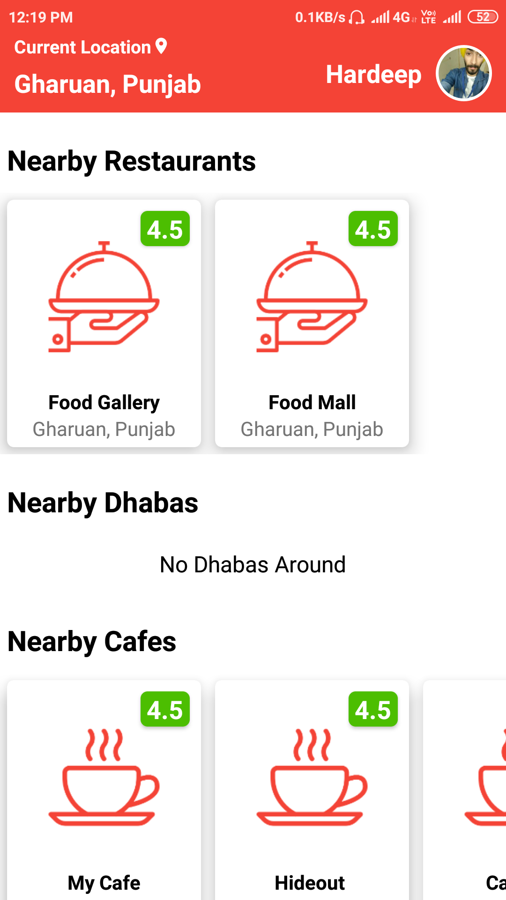

### Search Places Cuisine Wise

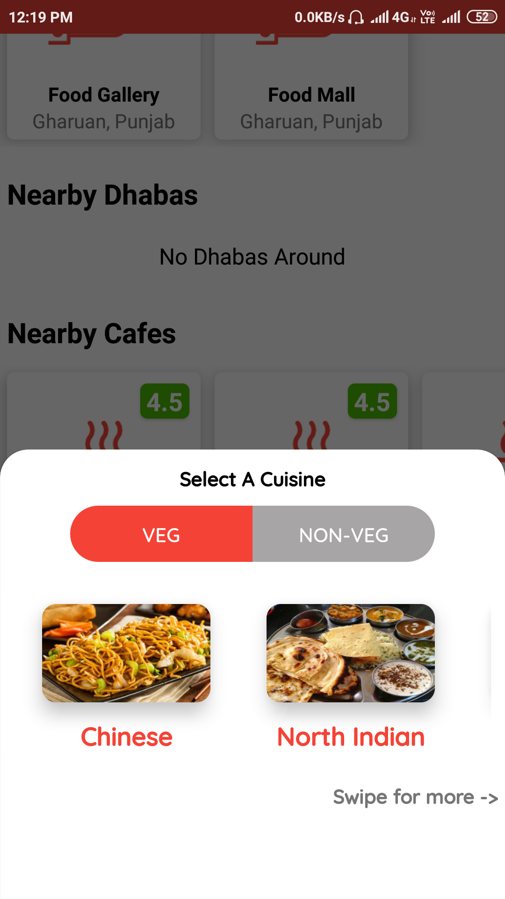

### Confirm Search

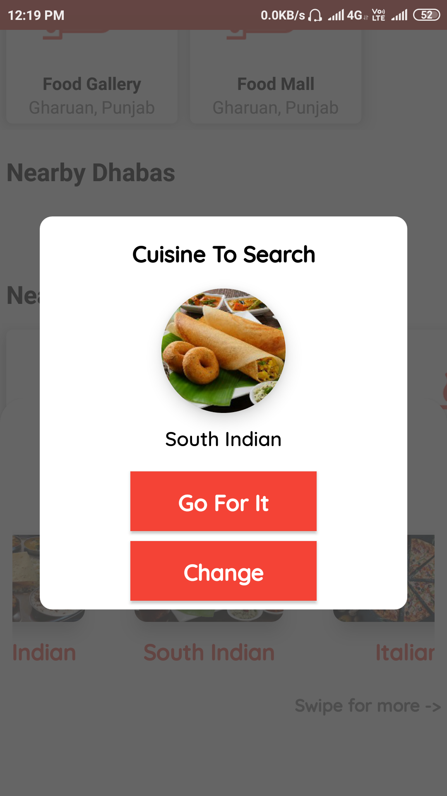

### Searching

### Found The Places And Marked On The Map

### View Details Of The Particular Restaurant

## The Admin App

### Choose What type to add

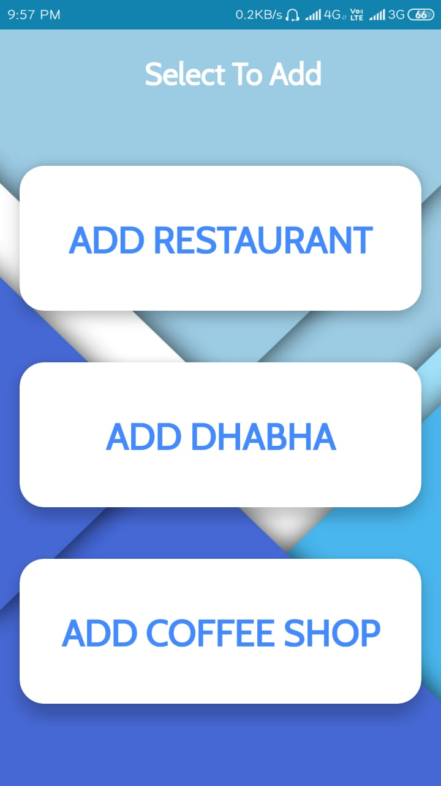

### Fill In Details And Add

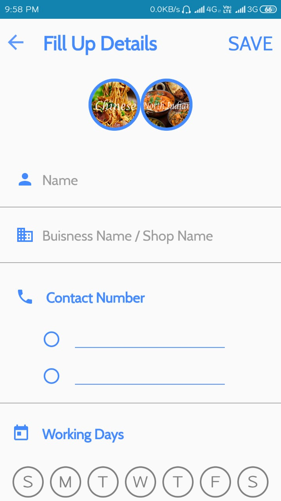

## The Owner's App

### List Of Restaurants Under the Owner

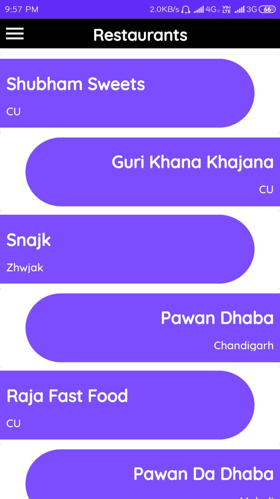

### Details Of The Restaurant

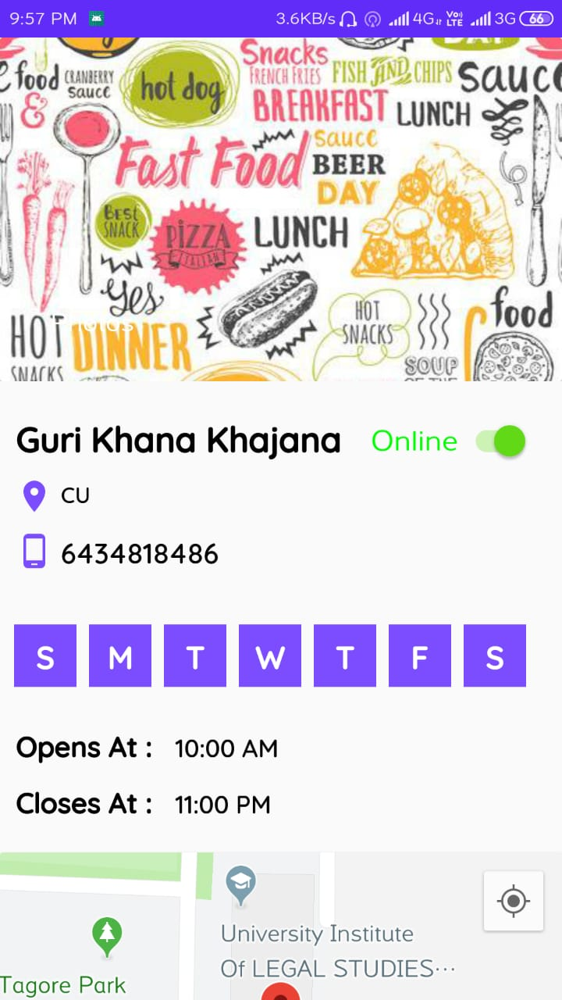

### Change Or Update Details

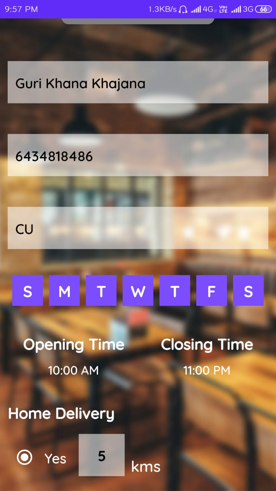

